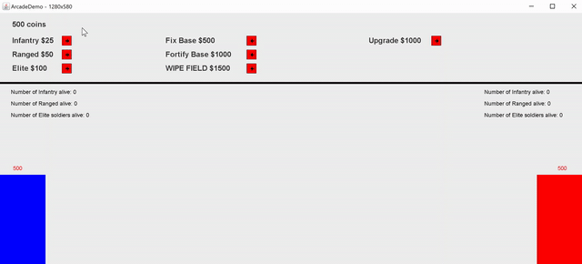

# Arcade-Style-Game-FallOfKingdoms-
A **Siingle Player Arcade Style Game** that involves fighting the enemy, killing the troops, and breaking the opponents castle. There are 3 types of soldiers with different health and different range for attack 
 as well as different attack power. 
## Getting Started

The game ready to run out of the box with a .jar file. 
### Abilities

The game has multiple things to choose from which each result in different outcome and powerup. In the store you have:

```
Infantry: The most basic form of melee close range troop
Ranged: Allows for attacking to begin further out--ranged troop
Elite: Highest hitpoint and damage--melee troop
Fix Base: Revives the health of the base back to it's max
Fortify Base: Increases the max health of the base
Wipe Field: Clears the entire field of enemy troop
Upgrade: Increases health and damage of all troops 
```
In addition to this, the player earns money for damaging the computer's castle or troop. More coins are earned as the player upgrades and the price of troops/consecutive upgrade also increases. Computer will also upgrade to respond to the player's upgrade. The computer also starts off with an advantage and has troops with higher health/damage.

## Video Walkthrough
Here's a sample walkthrough of the game running. As can be seen the player (blue) starts out with 500 coins and has to choose between different options to try and beat the computer. The computer uses the player's decisions, as well as preset moves to determine the next move.



The castles on either end have their remaining hitpoints above them and so does the lead troop from either side. The user can also see how many of each type of troop both sides has on the field as to better be able to strategize. 

## Challenges
The main challenge was keeping track of everything and allowing the player to interact with different parts of the game.In addition figuring out how to use the graphics files to create store and the movements were difficult. 

## Credit
- The graphics file was not written by me, though it was editted to suit the needs of the game
